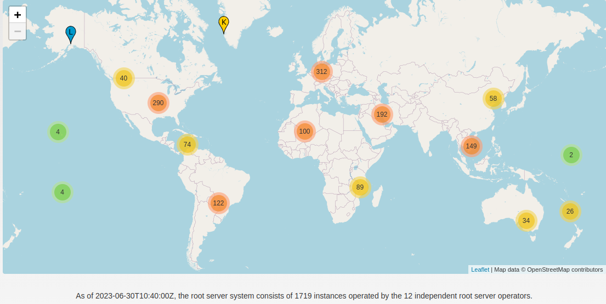

# BGP-ASN-DNS
This repository includes and summraise some resources in networking 

## DNS & IPs

### Important Resources 
- Root Servers Map
  - https://root-servers.org/ 
- Root Servers List
  - https://www.iana.org/domains/root/servers
- List of All TLD Domains
  - https://www.iana.org/domains/root/db
  - https://data.iana.org/TLD/tlds-alpha-by-domain.txt
- IPv4 Multicast Address Space Registry
  - https://www.iana.org/assignments/multicast-addresses/multicast-addresses.xhtml
- IPv4 Special-Purpose Address Registry
  - https://www.iana.org/assignments/iana-ipv4-special-registry/iana-ipv4-special-registry.xhtml
- Autonomous System (AS) Numbers & Registrar
  - https://www.iana.org/assignments/as-numbers/as-numbers.xhtml
- Special-Purpose Autonomous System (AS) Numbers
  - https://www.iana.org/assignments/iana-as-numbers-special-registry/iana-as-numbers-special-registry.xhtml
- A root server matrics
  - https://a.root-servers.org/metrics


 
### Dig Command

- dig +trace google.com
- dig +norecurse google.com 
- dig google.com @a.root-servers.net
- dig +all +answer +multiline google.com any
- dig google.com any
- dig @ns.example.com -tAXFR example.com
  
- flags:
  - rd: Recursion Desired
  - ra: Recursion Available
  - aa: Authoritative Answer
  - qr: specifies whether it is a query (0), or a response (1)


## ASN 

### Important Resources
- ASN Info, Graph and Connected ASNs
  - https://bgp.he.net/AS8697#_asinfo
  - https://bgpview.io/asn/8376#info
- ASN IPs
  - https://bgp.he.net/AS8697#_prefixes
  - https://bgpview.io/asn/8376#prefixes-v4
 

## BGP & BGPlay 

### RIPE API
Full documentation cen be found in https://stat.ripe.net/docs/02.data-api/ (Very Interesting!)
- Get Country ASN List
  ```bash
  https://stat.ripe.net/data/country-asns/data.json?resource=jo&lod=1
  ```
- Get IP/Domain Info for DNS/IP
  ```bash
  curl --location --request GET "https://stat.ripe.net/data/dns-chain/data.json?resource=94.249.58.131"
  ```


### FB Goes Down! 
You can observe how FB went down on October 4, 2021 at 15:00 by extracting their NS server, extracting the ASN, and inserting it into the RIPE BGPlay. 
- https://stat.ripe.net/widget/bgplay


